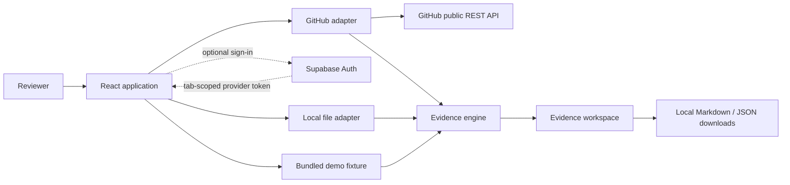

# Proofline Architecture

## Purpose

Proofline is a static, browser-only application that maps requirements for pull requests, single commits, and comparisons to inspectable code and test evidence. It does not send imported source code to an application backend or model provider, and it does not claim to prove correctness.

## System Context



The deployed Vercel site serves static assets only. GitHub requests originate from the user's browser. Optional sign-in uses Supabase as a managed OAuth broker; the GitHub provider token remains in tab-scoped session storage. Local files remain in the browser. Exported reports are generated with browser APIs and downloaded only after an explicit user action.

## Architectural Boundaries

### Domain: `src/domain/evidence/`

Pure TypeScript with no React, DOM, network, browser-storage, or provider dependencies.

Responsibilities:

- Parse normalized requirement and test inputs.
- Produce strong exact-ID associations and weaker suggested associations.
- Derive neutral evidence states using deterministic rules.
- Preserve rule, matched text, location, strength, and source provenance.
- Serialize versioned Markdown and JSON reports.

The domain accepts normalized values rather than GitHub API payloads or browser `File` objects.

### Integrity Domain: `src/domain/integrity/`

Pure TypeScript changed-line detectors and normalized external-report adapters provide a separate implementation-integrity view.

- First-party rules are bounded, deterministic, and evidence-preserving.
- Every finding includes severity (`confirmed` or `suspected`), file, changed line, matched text, rule, impact, and remediation.
- Traceability states never change because of integrity heuristics.
- Mature analyzers remain authoritative for lint, coverage, dead code, duplication, and complexity; Proofline ingests their reports rather than recreating their algorithms.
- Reinvention findings require concrete repository utility or dependency-manifest evidence.

### Configuration: `src/config/`

One typed, validated source of truth for operational bounds:

- 100 changed PR files.
- 6 requirement-document candidates.
- 256 KB per fetched candidate document.
- 5 MB per local import.

Adapters and UI read the same configuration. Feature code must not duplicate these numbers.

### Integrations: `src/integrations/`

Adapters translate external inputs into domain values.

The GitHub adapter:

- Parses canonical public pull-request, single-commit, and comparison URLs.
- Retrieves change metadata, changed files, patches, repository tree, head checks, and bounded document candidates.
- Handles pagination, truncation, absent patches, rate limits, cancellation, and network failures.
- Supports anonymous reads or an optional tab-scoped GitHub provider token obtained through Supabase-managed OAuth; it never accepts a personal access token.
- Caches fresh responses in page memory, deduplicates identical in-flight requests, and uses ETag revalidation after the freshness window.
- Inspects requirement-document candidates progressively by path-score tier and stops after finding a viable formal source.

The local adapter:

- Reads supported specification, unified-diff, and JUnit XML files.
- Enforces file type, decoding, and configured size bounds before parsing.
- Provides a fallback when a public PR cannot be analyzed.

### Application: `src/app/analysis/`

An orchestration layer coordinates adapters and the domain engine through an explicit state machine:

```text
idle -> loading-source -> choosing-requirements -> analyzing -> ready
                         \-> error               \-> error
any non-idle state -> idle (reset)
```

It owns cancellation, progress, ambiguity confirmation, and user-facing failures. State lives only in page memory and is lost on refresh or closure.

### Presentation: `src/app/`, `src/components/`, `src/styles/`

React renders normalized view models and dispatches user intent. Components do not call GitHub directly or implement association rules.

Primary surfaces:

- Landing/import experience.
- Requirement-source confirmation.
- Evidence matrix.
- Requirement evidence detail.
- Markdown and JSON export controls.
- Actionable error and limit states.

All primary workflows must support keyboard operation, visible focus, semantic structure, labeled controls, WCAG 2.2 AA contrast, live status announcements, and evidence cues that do not depend on color.

### Demo: `src/demo/`

A versioned synthetic fixture uses the same normalized contracts and analyzer as live inputs. It includes strong, suggested, passing, failing, and missing signals and requires no network access.

## Data Flow

1. The reviewer enters a public GitHub pull-request, commit, or comparison URL; selects local files; or starts the bundled demo.
2. The selected adapter validates and normalizes bounded inputs.
3. Requirement discovery ranks PR text, qualifying linked issues, and repository documents with an explanation for every candidate.
4. The reviewer confirms ambiguous sources when necessary.
5. The domain engine extracts source-authored requirements or, when none exist, visibly generated author-declared claims; then it associates evidence and derives neutral states.
6. The integrity domain scans changed lines and normalizes any supplied analyzer reports.
7. React displays traceability and integrity evidence without changing domain conclusions.
8. The reviewer may explicitly create local Markdown or JSON downloads.
9. Reset, refresh, or closure discards the in-memory analysis.

## Requirement Discovery

Discovery is heuristic but explainable:

- Full issue URLs and `fixes`, `closes`, or `resolves` references are automatic issue candidates.
- Bare `#123` mentions require user confirmation before fetching.
- Repository candidates receive deterministic scores for path, filename, supported extension, bounded size, and requirement-like content.
- At most 20 bounded text candidates are inspected.
- Ties or insufficient confidence require user selection.
- Paste, upload, and manual repository-file selection always override discovery.

Discovery confidence never becomes implementation or test evidence.

## Evidence Semantics

Strong association requires an exact source-authored stable requirement ID in a diff, source file, test name, or test result. Generated `CLAIM-nnn` labels are presentation identifiers only and can never create strong evidence. Normalized phrase or keyword overlap is suggested evidence only and is never promoted to strong evidence.

States:

- `test-evidence-found`: strong implementation and strong passing-test evidence exist.
- `implementation-evidence-only`: strong implementation evidence exists without strong passing-test evidence.
- `failing-test-evidence`: strong linked execution evidence fails.
- `no-evidence-found`: no applicable association exists.
- `ambiguous-evidence`: signals conflict or only inconclusive suggested evidence exists.

These states describe observed artifacts. They are not correctness, security, or merge recommendations.

## Security and Privacy

- Treat GitHub, Markdown, code, XML, filenames, and uploaded content as untrusted.
- Render code as text and sanitize any rendered Markdown; never execute imported HTML or scripts.
- Bound request counts, files, file sizes, parsing depth, and displayed content.
- Support `AbortController` cancellation and ignore stale responses.
- Do not persist imported content in localStorage, IndexedDB, cookies, logs, analytics, databases, or servers.
- Do not introduce credentials, connection strings, API keys, authentication bypasses, or external model calls.
- Do not log repository content, imported content, user identifiers, or potential secrets.

## Failure Strategy

- Invalid input: retain user context and show a corrective example.
- GitHub rate limit or network failure: explain the cause and offer local import or bundled demo.
- Large PR or document: report the configured limit and stop without partial conclusions.
- Missing/truncated patch: label the evidence unavailable rather than treating it as absent implementation.
- Ambiguous requirements: pause for user confirmation.
- Malformed Markdown/XML/diff: identify the source and fail safely without rendering active content.
- Export failure: keep the analysis intact in memory and allow retry.

## Testing Strategy

- Domain unit tests cover parsers, association rules, state derivation, and report stability.
- Adapter tests mock all network calls and cover pagination, limits, errors, linked issues, and candidate ranking.
- Application tests cover state transitions, cancellation, reset, and non-persistence.
- Component tests cover keyboard operation, accessible naming, focus, live status, filters, details, and exports.
- End-to-end smoke tests cover the deterministic demo and one supported public PR without placing external calls in the unit suite.

## Deployment

- Vite produces static assets deployed to Vercel through the root `vercel.json`; Vercel installs from the committed npm lockfile, builds with Node.js 24, publishes `dist`, and rewrites SPA paths to `index.html`.
- No application server, serverless function, database, queue, or persistent storage is required.
- Optional Supabase browser configuration is provided through Vercel project environment variables and compiled into the Vite bundle; the GitHub OAuth client secret remains only in Supabase.
- The deployment must remain usable through the bundled demo when GitHub is unavailable.

## Deferred Architecture

Private-repository support is a post-hackathon enhancement using a least-privilege GitHub App or OAuth flow and a dedicated token-handling backend. Personal access tokens are not an accepted design. Saved analyses, automated report commits, additional source-control providers, and optional model-assisted explanations are also deferred.
